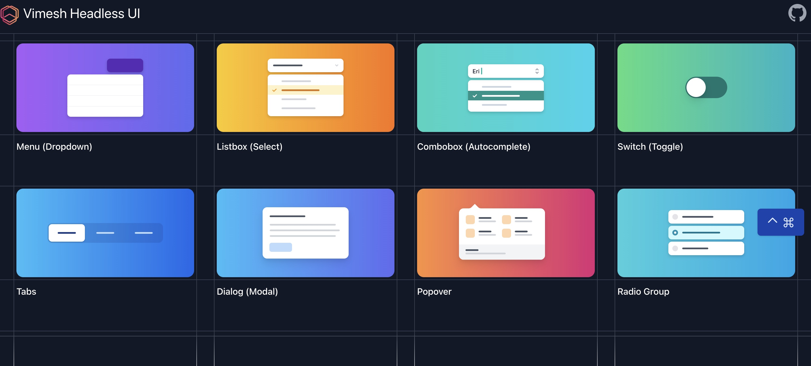
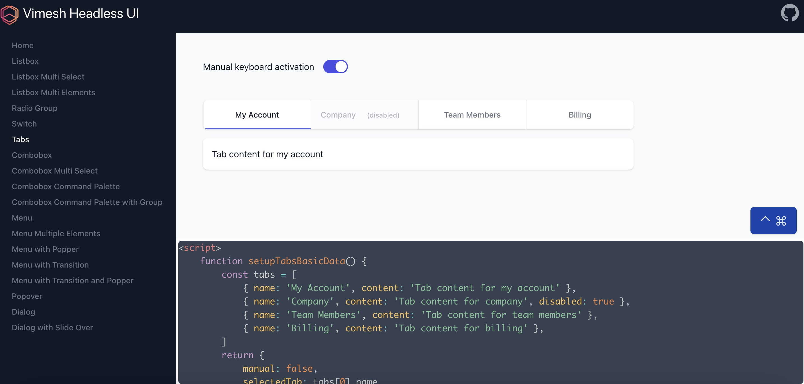

# Why Vimesh UI
I hate compiling frontend code with complex toolchains, like webpack, rollup, vite etc. Unfortunately, most frontend frameworks heavily depends on them. Alpine.js is clean, powerful and without extra build process. While it is a challenge to develop a UI library directly with Alpine.js. Vimesh UI is an ultra lightweight library to build UI components for Alpine.js. 

# Basic Usages
Just add Vimesh UI CDN url before Alpine.js
```html
    <script src="https://unpkg.com/@vimesh/ui"></script>
    <script src="https://unpkg.com/alpinejs" defer></script>
```
Now there are three important Alpine.js directives to build your own UI components

## x-component
This directive creates an HTML native custom element around Alpine.js template.

```html
<head>
    <script src="https://unpkg.com/@vimesh/ui"></script>
    <script src="https://unpkg.com/alpinejs" defer></script>
</head>

<body>
    <vui-greeting>Vimesh UI</vui-greeting>

    <template x-component="greeting">
        <h1>Hello <slot></slot></h1>
    </template>
</body>
```
[Run on codepen](https://codepen.io/vimeshjs/pen/mdKKMpb)

It shows `Hello Vimesh UI`. Now let's add some interaction logic. There are two magics `$api` and `$prop` for a Vimesh UI component. `$api` comes from the return object of the first `<script>` inside of component template. `$prop` is function to get the passed value of component property:
```html
<head>
    <script src="https://unpkg.com/@vimesh/ui"></script>
    <script src="https://unpkg.com/alpinejs" defer></script>
</head>

<body x-data="{name: 'Vimesh UI'}">
    <vui-greeting greeting-word="Hi" :who="name"></vui-greeting>

    <template x-component="greeting">
        <h1><span x-text="$prop('greeting-word')"></span> <span x-text="$prop('who')"></span></h1>
        <button @click="$api.say()">Click me</button>
        <script>
            return {
                say() {
                    alert(this.$prop('greeting-word') + ' ' + this.$prop('who'))
                }
            }
        </script>
    </template>
</body>
```

[Run on codepen](https://codepen.io/vimeshjs/pen/JjZBvPy)

The default custom element namespace is `vui`, which could be modified in config. You could also give a different namespace with format `x-component:{namespace}="component name"`

```html
<head>
    <script src="https://unpkg.com/@vimesh/ui"></script>
    <script src="https://unpkg.com/alpinejs" defer></script>
    <script>
        $vui.config = {
            namespace: 'myui'
        }
    </script>
</head>

<body x-data>
    <myui-greeting>My UI</myui-greeting>
    <new-greeting>My UI</new-greeting>

    <template x-component="greeting">
        <h1>Hello <slot></slot>
        </h1>
    </template>

    <template x-component:new="greeting">
        <h1>Hi <slot></slot>
        </h1>
    </template>
</body>
```
[Run on codepen](https://codepen.io/vimeshjs/pen/LYrrjdq)

The final html result will be

```html
...

<body x-data>
    <myui-greeting><h1>Hello My UI
        </h1></myui-greeting>
    <new-greeting><h1>Hi My UI
        </h1></new-greeting>
</body>
```
In some cases, we do not want the component tag to exist in the result. We could just add an `unwrap` modifier in `x-component`. 

```html
...

<body x-data>
    <myui-greeting>My UI</myui-greeting>
    <new-greeting>My UI</new-greeting>

    <template x-component.unwrap="greeting">
        <h1>Hello <slot></slot>
        </h1>
    </template>

    <template x-component:new.unwrap="greeting">
        <h1>Hi <slot></slot>
        </h1>
    </template>
</body>
```

The component tags `myui-greeting` and `new-greeting` will no longer exist in the final html result 

```html
...

<body x-data>
    <h1>Hello My UI
        </h1>
    <h1>Hi My UI
        </h1>
</body>
```

## x-import
Of course, we don't want to embed common components in every page. The `x-import` directive helps to load remote components asynchronously. Let's extract the greeting component into a standalone file. 
> /hello-remote.html
```html
<head>
    <script src="https://unpkg.com/@vimesh/ui"></script>
    <script src="https://unpkg.com/alpinejs" defer></script>
    <script>
        $vui.config.importMap = {
            "*": './components/${component}.html'
        }
    </script>
    <style>
        [x-cloak] {
            display: none !important;
        }
    </style>
</head>

<body x-cloak x-import="greeting">
    <vui-greeting>Vimesh UI</vui-greeting>
</body>
```
> /components/greeting.html
```html
<template x-component="greeting">
    <h1>Cloud Hello <slot></slot>
    </h1>
</template>
```
The components could be loaded from anywhere, like 
```html
    <script>
        $vui.config.importMap = {
            "*": 'https://unpkg.com/@vimesh/ui/examples/components/${component}.html'
        }
    </script>
```
[Run on codepen](https://codepen.io/vimeshjs/pen/poKKrYd)

Here is a more complete example:
> /counters.html
```html
<head>
    <script src="https://unpkg.com/@vimesh/style" defer></script>
    <script src="https://unpkg.com/@vimesh/ui"></script>
    <script src="https://unpkg.com/alpinejs" defer></script>

    <script>
        $vui.config.importMap = {
            "*": './components/${component}.html'
        }
    </script>
    <style>
        [x-cloak] {
            display: none !important;
        }
    </style>
</head>

<body x-cloak x-import="counter;counter-trigger" class="p-2" x-data="{name: 'Counter to rename', winner: 'Jacky'}">   
    Rename the 2nd counter : <input type="text" x-model="name" class="rounded-md border-2 border-blue-500">
    <vui-counter x-data="{step: 1}" :primary="true" title="First" x-init="console.log('This is the first one')" owner-name="Tom"></vui-counter>
    <vui-counter x-data="{step: 5}" :title="name + ' @ ' + $prop('owner-name')" owner-name="Frank"></vui-counter>
    <vui-counter x-data="{step: 10, value: 1000}" :owner-name="winner">
        <vui-counter-trigger></vui-counter-trigger>
    </vui-counter>
</body>
```
> /components/counter.html
```html
<template x-component.unwrap="counter" :class="$prop('primary') ? 'text-red-500' : 'text-blue-500'"
    x-data="{ step : 1, value: 0}" x-init="$api && $api.init()" title="Counter" owner-name="nobody">
    <div>
        <span x-text="$prop('title')"></span><br>
        Owner: <span x-text="$prop('owner-name')"></span><br>
        Step: <span x-text="step"></span><br>
        Value : <span x-text="value"></span><br>
        <button @click="$api.increase()"
            class="inline-block rounded-lg bg-indigo-600 px-4 py-1.5 text-white shadow ring-1 ring-indigo-600 hover:bg-indigo-700 hover:ring-indigo-700">
            Increase
        </button>
        <slot></slot>
    </div>
    <script>
        return {
            init() {
                console.log(`Value : ${this.value} , Step : ${this.step}`)
            },
            increase() {
                this.value += this.step
            }
        }
    </script>
</template>
```
> /components/counter-trigger.html
```html
<template x-component="counter-trigger">
    <button @click="$api.$of('counter').increase()"
        class="inline-block rounded-lg mt-2 bg-green-600 px-4 py-1.5 text-white shadow ring-1 ring-green-600 hover:bg-green-700 hover:ring-green-700">
        Tigger from child element</button>
</template>
```
[Run on codepen](https://codepen.io/vimeshjs/pen/RwJBygE)

## x-include
Sometimes we just need to load a piece of html. The `x-include` is convenient to use in this case. The `unwrap` modifier is used to remove the host html tag. 

> /include-article.html
```html
<head>
    <script src="https://unpkg.com/@vimesh/ui"></script>
    <script src="https://unpkg.com/alpinejs" defer></script>      
</head>

<body x-data>
    Load into the external "div" tag:<br>
    <div style="background-color: #888;" x-include="./static/article"></div>

    Unwrap the external "div" tag:<br>
    <div style="background-color: #888;" x-include.unwrap="./static/article"></div>
</body>
```
> /static/article.html
```html
<h1>Title</h1>
<p>
    Content
</p>
```

The final result will be 
```html
<head>
    <script src="https://unpkg.com/@vimesh/ui"></script>
    <script src="https://unpkg.com/alpinejs" defer></script>      
</head>

<body x-data>
    Load into the external "div" tag:<br>
    <div style="background-color: #888;">
    <h1>Title</h1>
    <p>
        Content
    </p>
    </div>

    Unwrap the external "div" tag:<br>
    <h1>Title</h1>
    <p>
        Content
    </p>
</body>
```

[Run on codepen](https://codepen.io/vimeshjs/pen/ExRpLbb)

## x-shtml
In Vimesh UI, please use x-shtml instead of Alpine.js original x-html, which has wrong behaviors in case of complex component lifecycle. 

# Advanced Usage
## $api for component
`x-data` is very convenient to use. Its data is accessible to all descendant elements. There is no problems for simple static web page. When developping reusable components, `x-data` is too open to store component own states. We do not want the properties to be modified occasionally just because of name confliction. `$api` allows to define **private** properties and methods. `$api` is only available to current component. At the same time, it inherets from x-data. That means if `this.somePropOrMethod` does not exist in $api, it will check `somePropOrMethod` from x-data. `$api` has some predefined properties and methods:

| Properties     | Description |
| ----------- | ----------- |
| $meta      | Get the meta info of current component, including type, namespace, prefix.       |
| $parent   | Get the closest parent component element        |

| Methods      | Description |
| ----------- | ----------- |
| $of('component type')      | Find the $api of specific component type of its ancestors       |
| $closest(filter)   | Find the closest ancestor component element according to the filter, which could be component type or a function        |
| $find(filter)   | Find all descendant component element according to the filter, which could be component type or a function         |
| $findOne(filter)   | It is similar to $find, but only return the first component element match the filter        |

`x-data` has two lifecycle hooks: init and destroy. `$api` has equivalents:
| x-data     | $api |
| ----------- | ----------- |
| init()      | onMounted()   |
| destroy()   | onUnmounted()    |

## Multi pages application
Check [mpa example](/examples/mpa)


## Single page application
Check [spa example](/examples/spa/app.html)

## Real UI components
[Vimesh Headless UI](https://github.com/vimeshjs/vimesh-headless) includes some useful components, like Listbox, Combobox, Menu, Dialog, Tabs, Switch etc. It is a good start point for you to develop your own UI library.




